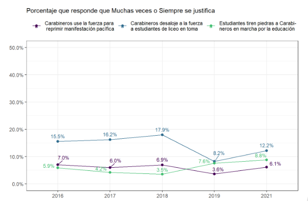

---
output:
  pdf_document: default
  html_document: default
---
# Introducción

<div style="text-align: justify">

La violencia es uno de los componentes principales de la experiencia humana. Se presenta de distintas formas y en distintos niveles; está en la guerra y en los conflictos raciales, así como también en el crimen y las relaciones interpersonales. Es un fenómeno que tiene implicancias en todas las esferas de la vida: causa sufrimiento, humillación y, muchas veces, va aparejada de grandes cambios sociales. En consecuencia, no es sorpresa que haya sido un elemento crucial para la reflexión a lo largo de la historia. Desde los orígenes del pensamiento moderno la violencia ha sido concebida cómo uno de los principales fenómenos a resolver para avanzar hacia la convivencia pacífica entre los seres humanos. Por ejemplo, desde el contractualismo se concibe la entrega del derecho al uso de la violencia a un soberano como parte del proceso civilizatorio [@Hobbes2002]. Así también, desde la sociología clásica se plantea a la centralización y racionalización de la violencia cómo un elemento constitutivo a la formación de los Estados modernos [@Weber1996]. En la actualidad, la necesidad de lidiar con la violencia para avanzar hacia la convivencia pacífica se traduce en que todas las sociedades democráticas deben enfrentarse al desafío de disminuir los niveles de violencia [@Gerber2017; @Keane2004]. 

<div style="text-align: justify">

El que las sociedades democráticas tengan la tarea de disminuir los niveles de violencia implica que la violencia es, difícilmente, un fenómeno que se pueda erradicar en el corto plazo. Más bien, es un fenómeno con el cual se debe coexistir, planteando límites para su uso [@Keane2004] o, dicho de otra forma, determinar las situaciones en que el uso de la violencia está justificado. Generalmente, se entiende la violencia como el daño físico ejercido de manera intencional [@Bufacchi2005] y su justificación como una argumentación de que el acto violento trae alguna consecuencia que lo compense [@Frazer2020]. Desde la tradición sociológica, se tiene la concepción de que es el Estado quien tiene el monopolio de la violencia física [@Weber1996] y por ende son los agentes representantes del Estado quienes tienen el derecho legítimo al uso de la violencia: cómo su tarea es mantener el orden social, el uso de la violencia les está justificado. Sin embargo, tanto la literatura como los procesos sociopolíticos recientes han mostrado que este no es siempre el caso. Existen una serie de otras situaciones en las que la violencia podría ser justificada por parte de la población.

<div style="text-align: justify">

El que la población justifique la violencia en los tiempos de las democracias contemporáneas parece algo paradójico, más aún considerando los esfuerzos a nivel internacional que se han hecho para erradicar la violencia [@WHO2014; @WHO2010; @WHO2009]. No obstante, las movilizaciones masivas del 2019 en Chile hacen pensar que esta no es una idea tan lejana a la realidad. El llamado _estallido social_ fue un proceso caracterizado por violaciones sistemáticas a los derechos humanos por parte de la policía [@Human2019; @ONU2019; @Defensoria2020; @Amnistia2020], así como también por un alza en la cantidad de protesta violenta, en comparación a otro tipo de conflictos en los últimos 10 años en el país [@Joignant2020]. Este evento permite plantear dos reflexiones. Por un lado, pareciese ser que la violencia ejercida por agentes estatales no siempre está justificada. Por otro lado, gran parte de la población consideró a la violencia como una vía de manifestación justificada. De hecho, encuestas recientes muestran que la violencia como forma de protesta tuvo un incremento en sus niveles de justificación, mientras que la justificación a la violencia policial disminuyó considerablemente [@ELSOC2019] (ver Figura \@ref(fig:justintro)). El ascenso en los niveles de justificación de la violencia se torna especialmente relevante si se tiene en consideración que aquellos que justifican la violencia son más tendientes a ejercerla [@Nunes2021], o a condonar el actuar violento de otros miembros de la sociedad [@Kalmoe2014]. La consecuencia de esta relación es una potencial escalada de violencia que amenaza la convivencia pacífica [@Gerber2017]. Ante esta problemática, se abren las interrogantes sobre quiénes y por qué razones las personas justifican la violencia.


```{r justintro,echo=FALSE,out.width='75%',fig.cap='Justificación de la Violencia de Carabineros y Manifestantes por año'}
 
```


<font size="1"> Fuente: COES (2022) Radiografía del Cambio Social: Análisis de Resultados Longitudinales ELSOC 2016-2021. Presentación de Resultados COES. Enero, Santiago de Chile. </font>

<div style="text-align: justify">

Los estudios empíricos que han buscado responder estas preguntas se pueden clasificar bajo una dicotomía que distingue la violencia de acuerdo a sus fines [@Blumenthal1972]. Es decir, si la violencia tiene por finalidad mantener el control social, como, por ejemplo, el actuar de agentes policiales. O si más bien, la violencia está dirigida al cambio social, como es el caso de manifestantes. Aquí, los estudios han girado en torno a tres teorías. La literatura criminológica, especialmente en los Estados Unidos, ha generado evidencia sistemática a favor de la teoría del conflicto [@Thompson2004]. En base a la idea de que la policía está al servicio de los grupos con mayor estatus a fin de mantener las jerarquías, es que minorías raciales y grupos de menor estatus tienden a apoyar menos la violencia de parte de la policía. En cambio, explicaciones desde la psicología se han basado en el rol de la ideología, a través de las teorías de la dominancia social (SDO, por sus siglas en inglés) [@Sidanius1999] y del autoritarismo de derecha (RWA, por sus siglas en inglés) [@Altemeyer1988]. En esta literatura se ha encontrado que estas ideologías se encuentran positivamente relacionadas al apoyo de la violencia por parte de la policía [@Gerber2017b]. También dentro de la literatura psicológica, en los últimos años se han incorporado las justificaciones de la violencia al marco de la justicia procesal [@Tyler2006], encontrando que aquellas personas que conciben a la policía como un actor legítimo, en tanto son justos en los tratos asociados a su rol, es que justifican más la violencia policial y menos la violencia cómo forma de protesta [@Gerber2017a].

<div style="text-align: justify">

La aplicación del marco de la justicia procedimental [@Tyler2006] para la comprensión de la justificación de la violencia ha permitido el desarrollo de una incipiente agenda de investigación. Tanto estudios internacionales [@Gerber2017b; @Bradford2017], cómo estudios en Chile [e.g. @Puga2016; @Gerber2016; @Gerber2017a; @Gerber2017] han generado hallazgos que sustentan la construcción de esta agenda. No obstante, la justicia no es un fenómeno unidimensional, sino que tiene múltiples dimensiones, siendo las más comunes la distributiva y la procesal [@Tornblom2007]. La justicia distributiva refiere a una evaluación normativa de la distribución de recursos (generalmente, ingresos) de una situación. En cambio, la justicia procesal se entiende cómo los juicios respecto a qué tan justo es el trato que ejercen ciertos actores (generalmente, autoridades) a los individuos. Considerando los hallazgos sistemáticos respecto al rol que tiene la justicia procesal en la justificación de la violencia, este trabajo abre la pregunta sobre sí es que otras dimensiones de la justicia podrían contribuir a explicar las dinámicas de la justificación de la violencia, como por ejemplo, la justicia distributiva. Considerando lo anterior, en este estudio propongo integrar a la justicia distributiva cómo una dimensión relevante para explicar las justificaciones de la violencia.

<div style="text-align: justify">

¿Por qué la justicia distributiva podría ayudar a comprender las dinámicas de la justificación de la violencia? Una primera razón es que el sentir injusticia es una fuerza social que motiva el comportamiento humano [@Liebig2016]. Considerando esta característica, en el marco de la sociología de la justicia se han desarrollado modelos teóricos que buscan esquematizar el rol de la injusticia tanto a nivel individual, así como sus consecuencias a nivel agregado [e.g. @Liebig2016]. Bajo este prisma, no es difícil encontrar propuestas que destacan el rol de la injusticia en acciones violentas: desde propuestas clásicas que consideran a la injusticia en la distribución de recursos cómo el factor movilizante de grandes revueltas o revoluciones [e.g. @BarringtonMoore1978; @Gurr1970; @Jasso1980], hasta estudios empíricos más recientes que consideran a la injusticia cómo un generador de emociones que motivan la protesta [e.g. @Agostini2021; @Tausch2011]. No obstante, este planteamiento implica una relación lineal entre sentir injusticia y sucesos violentos, sin considerar el rol de las justificaciones cómo una antesala de las acciones. Considerando que quienes ejercen violencia suelen previamente justificarla [@Nunes2021; @Kalmoe2014], se esperaría que el sentido de injusticia también tenga un efecto en cómo las personas justifican la violencia. Dicho de otra forma, antes de plantear una relación entre injusticia y violencia, es necesario comprender sí las personas consideran que el sentir injusticia es una razón para justificar la violencia.

<div style="text-align: justify">

Una segunda razón de por qué la justicia distributiva podría ayudar a comprender la justificación de la violencia es la conceptualización que se ha hecho del sentido de injusticia en la agenda de justicia distributiva. Particularmente, la teoría de las evaluaciones de justicia propone que el sentido de injusticia es resultado de las comparaciones que hacen los individuos entre la distribución real de recompensas y una que consideran justas para una situación de distribución [@Jasso1978; 1980]. Estas comparaciones pueden ocurrir cuando individuos evalúan situaciones de distribución en las que ellos son los recompensados, así cómo también cuando evalúan la justicia en la distribución para otros individuos [@Jasso2015]. Considerando esto, la injusticia que podría explicar las justificaciones de violencia no nace de la nada, sino que de procesos de comparación social que conllevan ciertas nociones de justicia y percepciones de cómo se distribuyen ciertas recompensas en la sociedad. Dicho de otra forma, la conceptualización del sentido de injusticia que entrega la agenda de justicia distributiva aporta una explicación más detallada respecto a qué implica sentir injusticia, lo que permitiría comprender cómo es que un individuo que siente injusticia podría llegar a justificar la violencia.

<div style="text-align: justify">

El caso de Chile se torna especialmente relevante para estudiar la relación entre el sentido de injusticia y las justificaciones de violencia. Chile es un país caracterizado por la desigualdad económica y social [@PNUD2017]. La lectura que se ha hecho del estallido social es que fue la acumulación de desigualdades estructurales que la población concebía como injustas lo que llevó a las grandes movilizaciones del 2019 [@Somma2020]. Inclusive, años atrás el informe de @PNUD2017 diagnosticaba las diversas desigualdades socioeconómicas que vivía el país, tales como las brechas de ingreso o las diferencias de trato. De esta manera, tiene sentido plantear que, en uno de los países más desiguales de América Latina, los sentimientos de injusticia jugaron un rol importante en que la gente justificara la violencia que caracterizó el estallido social. La intención de este escrito no es explicar las movilizaciones del 2019, sino usarlas como caso paradigmático en donde esta relación podría ser particularmente fuerte.

<div style="text-align: justify">

El argumento central de este estudio es que, posterior al estallido social, el sentido de injusticia en los ingresos llevó a los chilenos a justificar más la violencia por el cambio social, y menos la violencia por el control social. En este caso, me centraré en la violencia en el contexto de protesta, por lo que las situaciones que este estudio abarca tienen que ver con dos actores principales: carabineros y manifestantes. Además de esta hipótesis principal, basándome en la idea de que suelen ser los más desfavorecidos los que sienten la injusticia, analizaré el potencial rol moderador del sentido de injusticia en la relación entre la pertenencia a grupos desaventajados y las justificaciones de violencia en contexto de protesta.

<div style="text-align: justify">

Este trabajo pretende contribuir con tres aportes: dos a la literatura y uno social. El primer aporte consiste en incorporar una dimensión explicativa antes no explorada al estudio de la justificación de la violencia. En detalle, se pretende complementar la construcción de la agenda de justificación de la violencia y justicia procesal a partir del estudio de otra dimensión de la justicia. El segundo aporte corresponde a la contribución con evidencia empírica a los estudios de justicia en sociología. Este aporte se enmarca en la línea teórica que ha planteado el estudio de las consecuencias de la justicia cómo uno de los pilares en la agenda de justicia distributiva [@Jasso2015], así cómo también en los modelos recientes que se han desarrollado para comprender los determinantes y efectos de la justicia [@Liebig2016]. Dicho de otra manera, este trabajo pretende aportar, por un lado, a la agenda de justificación de violencia y, por otro, a la agenda de justicia distributiva. Además de los aportes a la literatura, este estudio ofrece un tercer aporte el cuál consiste en información para la discusión pública respecto al estallido social en Chile. Se pretende que la información y los hallazgos generados en este trabajo sean evidencia para la discusión sobre el estallido social. 

<div style="text-align: justify">

Este escrito tendrá cuatro secciones. Primero, se tratará con más detalle el objeto de estudio, a saber: la justificación de la violencia en contexto de protesta. Segundo, se revisarán los determinantes asociados a la justificación de la violencia según la literatura. Tercero, se revisarán los datos y el método a utilizar para la elaboración de resultados. Cuarto se presentarán los análisis. Por último, se presentan las discusiones y conclusiones de los hallazgos con relación a la literatura existente. Al final de este trabajo el lector tendrá conocimiento de algunas potenciales explicaciones de las justificaciones de violencia posterior al estallido social en Chile.

