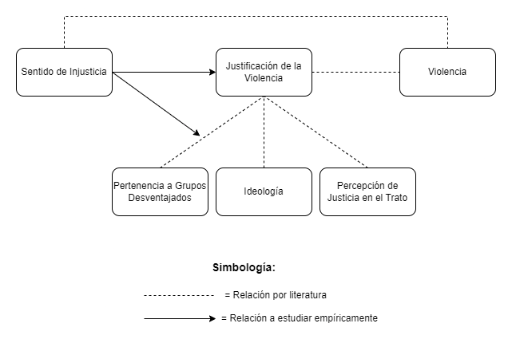
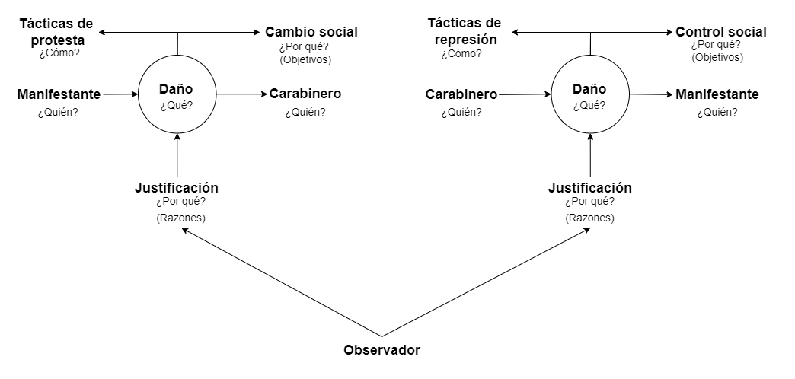
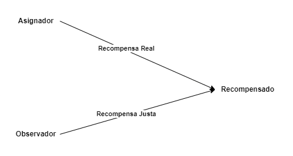
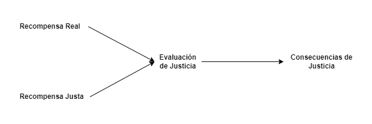
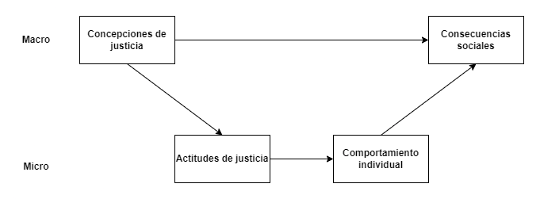

---
output:
  pdf_document: default
  html_document: default
---

```{r echo=FALSE}
knitr::opts_chunk$set(out.width="80%", fig.pos = "!ht", out.extra = "")
```

# Antecedentes Conceptuales y Empíricos

<div style="text-align: justify">

El objeto de estudio del presente trabajo corresponde a la justificación de la violencia en contexto de protesta. En la Figura \@ref(fig:newmodel) se esquematizan dos elementos pilares del estudio. En primer lugar, se presentan los puntos más importantes para entender qué es lo que se sabe actualmente sobre la justificación de la violencia en la literatura. En segundo lugar, se presenta la propuesta de estudio empírico de este trabajo. Los antecedentes se centrarán en describir cada relación esgrimida en la Figura \@ref(fig:newmodel), terminando en una argumentación respecto a porqué el sentido de injusticia podría tener tanto un efecto en la justificación de la violencia.

<div style="text-align: justify">

En detalle, la sección de antecedentes se compondrá de tres partes. Primero, se explicará conceptualmente el objeto de estudio que corresponde a la justificación de violencia en contexto de violencia. A fin de explicar el objeto de estudio, se comenzará presentando las principales corrientes que han definido la violencia y la definición de violencia que adopta este estudio. Luego, se definirá el concepto de justificación de la violencia y se presentará un modelo teórico construido a partir de los planteamientos de @Imbusch2005, @Jasso2016 y @Riches1986 que permite comprender todos los elementos implicados en una situación de violencia. Por último, se describirán cuales son las particularidades que entrega el contexto de protesta en el estudio de la justificación de violencia.

<div style="text-align: justify">

Segundo, se presentará la literatura relacionada a las determinantes de la justificación de la violencia. Se detallarán los hallazgos de la literatura en relación al rol de la pertenencia a grupos desaventajados, la ideología y las percepciones de justicia en el trato. Tercero, se presentará la literatura relacionada al sentido de injusticia en la distribución de ingresos. Por una parte, se explicarán los orígenes del concepto, su definición y cómo se ha operacionalizado en la literatura. Por otra parte, se desarrollará el argumento respecto a por qué el sentido de injusticia podría tener un efecto directo en las justificaciones de violencia, así cómo un efecto moderador en la relación entre pertenencia a grupos desaventajados y la justificación de la violencia. 

<div style="text-align: justify">

Una vez explicado el argumento, se procederá a plantear las principales hipótesis del estudio.

```{r newmodel,echo=FALSE,out.width='75%',fig.cap='Esquematización de la literatura de Justificación de la Violencia'}
 
```

<font size="1"> Fuente: Elaboración propia </font>


## Justificación de la Violencia en Contexto de Protesta

### Violencia: Desglosando el Concepto

<div style="text-align: justify">

Distintas calificaciones se han usado en la literatura para expresar la complejidad que significa estudiar la violencia. Se le ha llamado un concepto borroso e inestable [@Mider2013], peligroso, pero necesario [@Keane2004], multifacético [@Heitmeyer2005], esquivo y difícil [@Imbusch2005], confuso y subconceptualizado [@Stateva2009] o incomprendido [@Bufacchi2007]. Los esfuerzos por definir la violencia han llevado a una amplia producción académica [e.g. @Kurt2008; @Heitmeyer2005; @Bufacchi2009a] que ha buscado sintetizar esta complejidad. El punto de partida de esta empresa intelectual es siempre el mismo: la definición de violencia no es solo una, sino que viene en muchos tipos y formas. Ante tal complejidad es que un estudio sobre la violencia, especialmente uno de carácter empírico, debe dejar bien establecida qué es la violencia y qué tipo de violencia se está estudiando.

<div style="text-align: justify">

Una de las distinciones base en la literatura refiere al tipo de enfoque que se adopta al momento de definir la violencia. Es decir, ¿cuál es el criterio que se prioriza al momento de definir si algo es violento o no? Los académicos han coincidido en que la gran mayoría de las definiciones que se pueden encontrar se centran en 1) el uso de la fuerza física o 2) la violación de derechos, lo que da pie a los dos enfoques existentes: el enfoque minimalista y el enfoque comprehensivo [@Bufacchi2005]. 

<div style="text-align: justify">

Las definiciones que se engloban dentro del enfoque minimalista suelen enfocarse en situaciones interpersonales de perpetrador-víctima, donde lo que determina que un acto sea violento son dos elementos.  Primero, que el perpetrador utilice la fuerza física para generar algún tipo de daño o lesión a la víctima. Segundo, que este ejercicio del daño sea realizado de manera intencional. Esto conlleva que quien ejerce el daño es consciente del acto y, por ende, un mero accidente no es clasificable cómo un acto violento. Tomando en consideración ambos puntos, el enfoque minimalista comprende la violencia cómo el uso de la fuerza física para ejercicio del daño intencional. Dada la estrechez de su definición, tiene la ventaja de que hace a la violencia un fenómeno fácilmente delimitable y abordable para la investigación empírica. Además, al incluir la idea de intencionalidad cómo parte de su definición, permite una discusión más clara sobre la evaluación normativa del acto. Autores como @Keane2004 o @Coady2008 llaman a preservar este tipo de definiciones por su fácil operacionalización. Sin embargo, autores como @Galtung1969 o @Bufacchi2007 argumentan que delimitar la violencia hacia la fuerza física, la intencionalidad y el daño lleva a ignorar una serie de dimensiones de la violencia igualmente importantes, tales como la violencia psicológica, simbólica o estructural.

<div style="text-align: justify">

En contraste al enfoque minimalista, el enfoque comprehensivo pone el foco en la idea de violación. Violar significa la transgresión de un límite o norma [@Bufacchi2005; @Bufacchi2007], sin embargo, las diferencias en las definiciones de los autores emergen ante la pregunta de ¿qué es violado? Autores como @Gerd1969 responden definiendo la violencia como la violación de tres reglas morales: no matar, no causar daño, no deshabilitar. Otros autores han propuesto que un acto de violencia es aquel que viola los derechos más básicos de un individuo, así como el derecho a la vida o a la seguridad [@Copoeru2020]. La ventaja de este enfoque es que logra abarcar las dimensiones que la versión minimalista de la violencia dejaba de lado. Al no estar enfocada en situaciones interpersonales donde lo que prima es el ejercicio del daño, este enfoque podría ser utilizado para representar tipos de violencias que no son evidentemente observables, cómo violencias insertas en las estructuras sociales o en la cultura. Por ejemplo, @Galtung1969 fue pionero en proponer el concepto de violencia estructural, aludiendo a aquellas situaciones donde condiciones de la estructura social influyen en que las realizaciones reales de los individuos se alejen de sus realizaciones potenciales. La desventaja de esta aproximación es su carácter omniabarcante, autores como @Bufacchi2005 plantean que este enfoque puede llevar a concebir la violencia como todo lo moralmente incorrecto y privandolo de su utilidad conceptual. La violencia pasa a ser un detector de injusticias más que un concepto con utilidad para la reflexión teórica y la investigación empírica [@Arostegui1994].

<div style="text-align: justify">

En síntesis, los componentes principales del enfoque minimalista son la fuerza, la intencionalidad y el daño, siendo una definición que se centra en el acto directo del perpetrador. En cambio, el enfoque comprehensivo se centra en la violación de los limites o las normas, usualmente de derechos, poniendo el foco en la vivencia de la víctima. Dada su claridad conceptual, y a falta de una base empírica sobre qué es lo que entienden los chilenos por violencia, es que este trabajo se basa en una definición minimalista de la violencia.

### Justificación de la Violencia: por el Cambio y por el Control Social

<div style="text-align: justify">

La justificación de la violencia se refiere a una entrega de razones para argumentar que un acto violento tiene algún tipo de sentido y que no es una acción meramente arbitraria [@Basaure2020]. Generalmente, esa argumentación se refiere a que las consecuencias del acto traen consigo algún bien [@Frazer2019]. Es decir, quienes justifican la violencia son aquellas personas que consideran que las consecuencias generadas por el acto violento traerán un bien que compense el daño efectuado durante el proceso. El conocido dicho _el fin justifica los medios_ representa bastante bien esta postura. Enfocar la justificación de la violencia a partir de sus consecuencias significa concebir la violencia como un acto instrumental [@Blumenthal1972; @Arendt2005], o sea, que cuenta con un fin que orienta su actuar. Por ende, la discusión sobre la justificación de la violencia gira en torno a cuáles son esos fines por los cuales las personas estarían dispuestas a utilizar medios violentos para conseguirlo.

<div style="text-align: justify">

El campo de estudios sobre la justificación de la violencia se puede dividir en dos grandes áreas disciplinares. Primero están los estudios en teoría política, filosofía y ética, los cuales han contribuido con reflexiones desde un punto de vista normativo. Estos trabajos giran en torno a una gran pregunta ¿puede la violencia ser justificada? Generalmente esta pregunta se sitúa en el campo de la violencia política, indagando en las condiciones, los argumentos y los principios por los cuáles se podría argumentar que la violencia revolucionaria o la violencia en contexto de protesta son moralmente defendibles [@Demirbas2019; @Frazer2019; @Gerd1969; @Hills2011; @Keane2004; @Magil2008; @Nielsen1981; @Wells1970]. Las discusiones en torno al argumento *ticking bomb* [ver @APT2007; @Bufacchi2006] o al asesinato de Hitler [ver @Dean2005; @Frazer2019] son algunos ejemplos de estas situaciones. Si bien no es la prioridad de este trabajo el enfoque normativo, si sienta una base importante para su estudio empírico, especialmente considerando que muchos estudios empíricos sobre violencia han caído en confusiones conceptuales por no considerar los aportes de la literatura teórica-normativa [@Bufacchi2007]. Segundo, está el estudio empírico sobre los factores que llevan a las personas a justificar la violencia [e.g. @Blumenthal1972; @Jackson2013]. Será en esta segunda área temática donde este trabajo se enmarca, y en donde sentará sus aportes. Dado este enmarque, se presenta a continuación un breve recorrido por lo que han sido las principales agendas de investigación.

<div style="text-align: justify">

El primer estudio empírico que trata las justificaciones de violencia desde un enfoque instrumental es el de @Blumenthal1972. Este estudio sienta las bases al conceptualizar la violencia de acuerdo a dos fines contrapuestos: por el control social y por el cambio social. A grandes rasgos, la violencia por el control social son aquellas acciones orientadas a la mantención de las jerarquías en la sociedad y la violencia por el cambio social las acciones que buscan generar un cambio en esas jerarquías. En base a esta distinción, los enfoques se han diversificado. Por un lado, la violencia por el control social puede ser ejercida por agentes privados o públicos. Cuando se trata de agentes privados, el estudio se ha centrado en actitudes hacia el castigo y la justificación de linchamientos por parte de la ciudadanía [e.g. @Gerber2012; @Gerber2016; @Puga2016]. Cuando se trata de agentes públicos, se ha acuñado el concepto de violencia institucional, entendida como las medidas que toma el Estado para reprimir principios de libertad y justicia con el fin de mantener el orden social [@Nielsen1981]. Ejemplos de este tipo de violencia son los castigos penales o la violencia policial [@Puga2016]. Por otro lado, la violencia por el cambio social puede ser a nivel revolucionario, o más bien tácticas de protesta que buscan generar cambios dentro de la sociedad [@Nielsen1981]. La violencia revolucionaria se refiere al uso de la violencia para lograr cambios estructurales a nivel político, social y económico [ver @Nielsen1977; @Sune2010; @Edyvane2020]. La violencia dentro del Estado para el cambio social apunta a la generación de cambios que no buscan la transformación total en el corto plazo. Este trabajo busca estudiar las justificaciones de violencia por el control social ejercida por agentes públicos (carabineros) y las justificaciones de violencia por el cambio social a nivel de tácticas de protesta (manifestantes).

<div style="text-align: justify">

Si bien esta es una distinción clave en los estudios contemporáneos de la justificación de la violencia, no fue retomada como tal hasta los años 2000 por autores como @Jackson2013 o @Gerber2016. Es más, gran parte de los aportes provienen de la literatura criminológica en los Estados Unidos bajo el estudio de conceptos como _actitudes_ o _apoyo hacia el uso de la fuerza por parte de la policía_, y no de violencia como tal. En esta línea, muchos artículos se centraron en los factores que lleva a la gente a apoyar uso de la fuerza policial [@Gamson1970; @Arthur1993; @Arthur1994; @Thompson2004; @Perkins2006; @Johnson2009] o también en el desarrollo de escalas para la medición de este concepto [@Barkan1998; @Jefferis2011]. La aplicación del concepto de violencia es más reciente, donde académicos, especialmente desde la psicología, han introducido dos marcos teóricos al estudio de la justificación de la violencia. Por un lado, los trabajos de @Henry2005 y @Gerber2017b han aplicado la teoría de la dominancia social [@Sidanius1999] y la teoría del autoritarismo de derecha [@Altemeyer1988]. Estas teorías parten del supuesto que la vida en sociedad está conformada por grupos con atribuciones de personalidad diferenciadas, donde ciertos grupos buscan dominar a otros. A raíz de esta aplicación es que en la literatura se utiliza el concepto de _violencia intergrupal_. Por otro lado, el trabajo de @Jackson2013 fue el primero en aplicar el marco de la justicia procesal, siendo las justificaciones de la violencia una actitud derivada de la legitimidad atribuida a los agentes de orden y de las nociones de procesos justos. Esta línea es la que se ha potenciado recientemente con los trabajos de @Gerber2017a, @Gerber2017b y @Bradford2017. Tanto la aplicación desde las teorías de la dominancia social como las de la justicia procesal han trabajado bajo la distinción de violencia por el cambio social y violencia por el control social.

<div style="text-align: justify">

El trabajo de @Gerber2017a ha sido particularmente importante al plantear una definición más detallada de ambos tipos de violencia. Por un lado, se entiende la violencia por el control social como “aquellas situaciones en donde la violencia es ejercida por grupos dominantes-mayoritarios por sobre grupos subordinados-minoritarios o cuando el objetivo de la violencia es el de reducir el potencial cambio en las estructuras normativas o jerárquicas de la sociedad” [@Gerber2017a, pp. 3-4, traducción propia]. Por otro lado, la violencia por el cambio social corresponde a “aquellas situaciones en donde la violencia es ejercida por grupos subordinados-minoritarios por sobre grupos dominantes-mayoritarios o cuando el objetivo de la violencia es crear cambios en la estructura jerárquica o normativa de la sociedad [@Gerber2017a, p.4, traducción mía]. Estas definiciones orientan el presente trabajo.

### Situación de Violencia

<div style="text-align: justify">

Un elemento que caracteriza la justificación de la violencia es su situacionalidad, es decir; la violencia se justifica de acuerdo a las características de la situación y los actores involucrados en esta [@Thompson2004; @Johnson2009]. Considerando que las características y actores implicados en una situación pueden variar, es necesario definir un modelo teórico que permita comprender los elementos necesarios a tener en cuenta al estudiar la justificación de la violencia de forma empírica. En consiguiente, propongo construir un modelo teórico a partir de tres planteamientos en la literatura.

<div style="text-align: justify">

El primer planteamiento es el de @Riches1986, quien conceptualiza una situación de violencia a partir de la metáfora del triángulo. Esta metáfora indica que una situación de violencia se compone de tres actores: el perpetrador, víctima y testigos. El principal aporte de este planteamiento es la idea de que cada actor involucrado en la situación de violencia tiene una perspectiva distinta respecto a la legitimidad o la justificabilidad de la situación. Autores cómo @Bufacchi2007 han criticado esta noción, argumentando que quien observa la situación tiene, inherentemente, una perspectiva imparcial del proceso. Sin embargo, el desarrollo empírico y teórico en la literatura sobre violencia han rebatido esta idea. Por ejemplo, los estudios de @Gerber2017a y @Gerber2021 muestran que la justificación de la violencia está mediada por la identificación con los actores involucrados en el proceso. En tanto, la tipología propuesta por @Imbusch2005 da cuenta de las distintas dimensiones que pueden variar en una situación de violencia. En síntesis, el planteamiento de @Riches1986 da cuenta de que efectivamente existen distintos actores con distintas perspectivas dentro de una situación de violencia.

<div style="text-align: justify">

El segundo planteamiento corresponde a la tipología de @Imbusch2005, quien plantea comprender la violencia cómo un concepto multidimensional. @Imbusch2005 propone que la violencia se compone de cuatro preguntas y siete dimensiones (ver Tabla 5 en Anexos). La pregunta sobre el ¿Quién? implica dos dimensiones de la violencia. Por un lado, los sujetos o perpetradores de la violencia, cómo por ejemplo, un delincuente o un policía. Por otro lado, están los objetos de la violencia los cuales pueden ser víctimas (personas) u objetos. La pregunta sobre el ¿Qué? refiere al efecto que tiene el acto violento en los objetos o las personas, el daño físico o la destrucción de un bien público son un ejemplo común en la literatura. La pregunta sobre el ¿Cómo? representa las formas en la que se ejerce la violencia, aludiendo a sus medios y circunstancias, por ejemplo, que un marido abofetee a su mujer o que un policía use la fuerza contra un manifestante en una marcha. La pregunta sobre el ¿Por qué? cuenta con tres dimensiones asociadas. Una primera dimensión corresponde a las causas y razones que se emiten a modo de justificar un acto de violencia. Una segunda dimensión corresponde a los propósitos y motivos que tienen los perpetradores respecto a sus actos. Y finalmente, la tercera dimensión corresponde a los modelos de justificación existentes para una acción violenta, y sí estos modelos son legítimos o no. Estas preguntas y dimensiones ayudan a identificar elementos concretos dentro de una situación de violencia.

<div style="text-align: justify">

El tercer planteamiento no viene del área de los estudios de la violencia, sino que de la justicia distributiva. En la literatura de justicia distributiva ha habido un enorme desarrollo empírico y teórico para determinar cuáles son las características de la situación y de los actores que inciden en el proceso de formación de ideas de justicia. @Jasso2016 propone que existen tres actores relevantes en este proceso: el Asignador, quien asigna recursos a un Recompensado y un Observador que evalúa la justicia de esta situación. Aquí la literatura empírica ha indagado en, por ejemplo, como las características del Recompensado afectan la evaluación que hace un Observador. Por ejemplo, se ha encontrado que las evaluaciones de justicia se basan en principios de justicia de acuerdo al género y el número de hijos de los Recompensados. Sí el Recompensado es una mujer con hijos, se suele evaluar la justicia en base a criterios de necesidad, en cambio, sí el Recompensado es un hombre sin hijos, se suelen emplear criterios de equidad [@Jasso1977]. De esta manera, el desarrollo en el área de la justicia distributiva representa un ejemplo empírico respecto un objeto de estudio que también varía dependiendo de las características de la situación y sus actores involucrados. Propongo que esta similitud puede actuar cómo una guía para los estudios de justificación de violencia.

<div style="text-align: justify">

La propuesta de este trabajo para comprender una situación violencia es, en primer lugar, combinar la idea de triángulo de @Riches1986 con las dimensiones propuestas por @Imbusch2005 . Esta combinación permite plantear específicamente cómo se relaciona cada actor dentro de la situación. Por ejemplo, combinando ambos planteamientos podríamos argumentar que la relación entre un Perpetrador y una Víctima se basa en el daño ejercido desde el primero hacia el segundo, el cual va de la mano con un propósito de por qué se ejerce ese daño y una forma en la que se ejerce. En segundo lugar, el planteamiento de @Jasso2016 sirve cómo un ejemplo de que efectivamente una juicio subjetivo que surge de una situación puede variar de acuerdo a las características de la situación y sus actores involucrados. Al llevar este desarrollo al estudio de la justificación de la violencia, ya no solamente se cuenta con un modelo teórico, sino que también con una guía para el estudio empírico.

```{r absmodel,echo=FALSE,out.width='75%',fig.cap='Modelo teórico de una situación de justificación de la violencia'}
knitr::include_graphics("images/absmodel.png") 
```

<font size="1"> Fuente: Elaboración propia a partir de planteamientos de @Riches1986, @Imbusch2005  y @Jasso2016. </font>


<div style="text-align: justify">

Combinando los tres planteamientos, nace el modelo teórico de una situación de violencia (ver Figura \@ref(fig:absmodel)). Este modelo cuenta con tres actores principales: Perpretador, Víctima y Observador. Es el Perpetrador quien ejerce un daño en la Víctima, a través de un medio y guiado por determinados propósitos. Ante este ejercicio del daño, el Observador entrega razones de por qué la acción del Perpetrador a la Víctima estaría justificada. En la Figura 3 se puede observar la aplicación de este modelo a la situación que este trabajo busca estudiar.


```{r espmodel,echo=FALSE,out.width='100%',fig.cap='Situaciones de violencia del presente estudio'}
 
```

<font size="1"> Fuente: Elaboración propia a partir de planteamientos de @Riches1986, @Imbusch2005  y @Jasso2016. </font>


<div style="text-align: justify">

Siguiendo la esquematización de la Figura \@ref(fig:espmodel), en este trabajo se estudian dos situaciones de violencia. La primera situación corresponde al ejercicio del daño desde un manifestante a un carabinero. En base a la literatura, se toma como supuesto que este ejercicio del daño está guiado por un propósito que es el cambio social y que se lleva a cabo a través de un medio que son las tácticas de protesta [@Blumenthal1972; @Gerber2016]. La segunda situación corresponde el ejercicio del daño desde un carabinero a un manifestante. Al igual que en la situación anterior, se toma por supuesto que esta acción tiene el propósito del control social y se lleva a cabo a través de tácticas represivas [@Blumenthal1972; @Gerber2016]. Ante estas dos situaciones, existe un observador que emite razones por las cuales cada situación se podría justificar o no. A modo de adelantar el enunciado del argumento principal, en este estudio se propone que el sentido de injusticia podría ser una razón por las cuales un observador podría justificar estas situaciones o no. En otras palabras, en este trabajo se toman cómo constantes quienes son los Perpetradores (carabineros y manifestantes) y sus propósitos (control y cambio social), las Víctimas (manifestantes y carabineros), así cómo también los medios y circunstancias (tácticas de protesta y de represión). El centro del estudio está en las razones y características del observador.

### Violencia en Contexto de Protesta

<div style="text-align: justify">

En la literatura sobre los movimientos sociales se ha trabajado la violencia a partir de los dos actores principales que componen una situación de acción contenciosa: manifestantes y policías. En lo que respecta a los manifestantes, por un lado, el desarrollo conceptual ha permitido clarificar cuáles son las particularidades de la violencia colectiva y sus diferencias con la violencia individual. Por ejemplo, según los planteamientos de @Tilly2003 la violencia colectiva se caracteriza por el ejercicio de daño o destrucción a personas u objetos realizado por al menos dos perpetradores de forma coordinada. Este desarrollo ha dado pie a tipologías de violencia colectiva [@Tilly2003] y estudios empíricos sobre el concepto [e.g. @Adang2011]. Por otro lado, la violencia se puede encontrar incluida dentro del concepto de repertorios de confrontación, los cuales se definen como “la totalidad de los medios de que dispone un grupo para plantear exigencias de distinto tipo a diferentes individuos o grupos” (Tilly en Tarrow, 1997, p.65). Algunos de estos medios son las manifestaciones o huelgas, las cuales pueden ser violentas o no. Los repertorios de confrontación han servido cómo punto de partida para que en la literatura se especifiquen las distintas acciones de protesta que existen [@Taylor2004; @VanDyke2004]. Este desarrollo ha devenido en el concepto de tácticas de protesta [@Medel2016], dentro de las cuáles se puede determinar qué acciones concretas se consideran violentas y cuáles no.

<div style="text-align: justify">

Según @Medel2016, las tácticas de protesta se dividen en cuatro categorías: convencionales, culturales, disruptivas y violentas. Las tácticas convencionales implican acciones como manifestaciones, marchas, recolección de dinero o firmas para causas colectivas y declaraciones públicas orientadas a autoridades. En cambio, las tácticas culturales implican una representación simbólica de alguna causa colectiva, por medio de actos artísticos o gráficos. Las tácticas disruptivas son aquellas que interfieren en la rutina cotidiana de las personas, cómo lo son la desobediencia civil, huelgas laborales, tomas de edificios o cortes de ruta. Por último, y lo más relevante para el presente trabajo, las tácticas violentas son todas aquellas que conllevan un daño o destrucción a alguna persona u objeto, cómo la destrucción de la propiedad pública o privada, saqueos o ataques a la policía.

<div style="text-align: justify">

En lo que respecta a la violencia de parte de parte de la policía, la literatura de movimientos sociales ha trabajado en torno al concepto de represión [@Davenport2012; @Earl2003] y de vigilancia policial en la protesta [@Porta1998; @Porta2004; @Mansley2013]. La conceptualización de represión ha incluido definiciones amplias cómo las de @Tilly1978 y otras más estrechas cómo las de @Davenport2007. @Tilly1978 define la represión cómo acciones que aumentan los costos de la protesta, en cambio, @Davenport2007 entiende la represión cómo hostigamientos, vigilancia, torturas y otras acciones ejercidas por agentes gubernamentales que violan ciertos derechos de los ciudadanos. Sí bien existe una discusión respecto a cómo definir represión [@Earl2011; @Davenport2012], un elemento común dentro de las definiciones es incluir la vigilancia policial en la protesta cómo un tipo de represión. La vigilancia policial es una de las respuestas del Estado ante las protestas y acciones contenciosas y se entiende cómo el manejo policial de los eventos de protesta [@Porta1998]. En esta área de la literatura se han desarrollado tipologías para entender los distintos tipos de vigilancia policial [@Porta2004; @Earl2003], así cómo también se ha investigado su rol en el aumento o disminución de la violencia colectiva [@Mansley2013]. Una de las tipologías que se usan hasta el día de hoy en estudios empíricos [e.g. @Velasquez2019] es la de @Earl2003, la cual se usará en el presente trabajo para situar qué tácticas represivas son violentas y cuáles no.

<div style="text-align: justify">

Según @Earl2003 el actuar policial en la protesta se puede clasificar de acuerdo a cinco niveles. El primer nivel corresponde a la inacción o el no hacer nada, es decir, la policía acude al lugar de la protesta pero no toma ninguna acción que la interfiera. El segundo nivel corresponde a acciones mínimas, cómo por ejemplo a la alerta por medio de altavoces y/o negociaciones con líderes. El tercer nivel corresponde a la disuasión, incluyendo acciones que busquen prevenir el desorden, cómo el levantamiento de barricadas o el arresto a los manifestantes. El cuarto nivel, corresponde a enfrentamientos directos, los cuales incluyen el uso de la fuerza y/o herramientas de disuasión cómo bombas lacrimógenas, carros lanza aguas o armas no letales. Por último, el quinto nivel corresponde a la arremetida. la cual incluye el uso de todas las tácticas disponibles, por ejemplo, arrestos, uso de la fuerza, bombas lacrimógenas etc.). 

<div style="text-align: justify">

En el presente estudio se considerarán cómo tácticas represivas violentas desde los niveles cuatro (enfrentamientos directos) y cinco (arremetida) de la tipología de @Earl2003, bajo el argumento de que el uso de la fuerza y/o de herramientas de disuasión puede implicar un daño intencional en quienes son reprimidos (i.e definición minimalista de la violencia). Siguiendo el protocolo de actuación de carabineros vigente [@Fernandez2019], las tácticas represivas violentas que serán consideradas en el presente trabajo son el uso de: vehículo lanza agua (conocido popularmente cómo guanaco), vehículo táctico de reacción (conocido popularmente cómo zorrillo), dispositivos químicos (e.g. bombas lacrimógenas o gas pimienta);  escopeta antidisturbios y armas letales.

<div style="text-align: justify">

Tanto las tácticas de protesta cómo las tácticas de represión se pueden encontrar en las escalas que se han desarrollado para medir la justificación de la violencia por el cambio social y por el control social. Por ejemplo, @Blumenthal1972 incluye en su constructo de violencia por el cambio social situaciones como el uso de bastones antidisturbios (i.e. lumas o porras), armas no letales y letales [ver Tabla 1 en @Blumenthal1972], y situaciones cómo el daño a la propiedad o las personas en el constructo de violencia para el control social [ver Tabla 3 en @Blumenthal1972]. Así también, para el contexto chileno @Gerber2016 incluye situaciones como la quema de camiones o el lanzamiento de piedras en lo que respecta a la violencia por el cambio social y otras como el uso de perdigones para la medición de la violencia por el control social. Sí bien las situaciones que plantea @Gerber2016 en su escala derivan de un contexto particular que es el conflicto Estado-mapuche, su escala puede ser aplicable a otros conflictos y/o contextos.

<div style="text-align: justify">

En suma, tanto las tácticas violentas de protesta, cómo las tácticas violentas de represión tienen en común el ejercicio intencional del daño. Ejemplos de tácticas violentas de protesta son la destrucción de bienes públicos y el lanzar piedras a la policía. En cambio, ejemplos de tácticas violentas de represión son el uso de la fuerza o el uso de herramientas de disuasión por parte de la policía. Siguiendo la Figura 3, tanto las tácticas de protesta, cómo las tácticas de represión corresponden a los medios y las circunstancias por las cuales el perpetrador ejerce un daño a la víctima. Es decir, la primera situación que busca estudiar este trabajo es aquella en la que un manifestante ejerce daño a un carabinero a través de tácticas de protesta y la segunda situación es lo contrario; cuando un carabinero ejerce daño en un manifestante a partir de tácticas represivas.

## Determinantes de la Justificación de la Violencia

<div style="text-align: justify">

Existen tres literaturas que han estudiado los determinantes de la justificación de la violencia. Primero, están los estudios criminológicos que se han enfocado en las actitudes al uso de la fuerza por parte de la policía. En general, estos estudios han encontrado evidencia a favor de las teorías del conflicto [@Chambliss1995; @Quinney1971; @Turk1969], donde se concibe que la policía está al servicio de los grupos con mayor estatus en la sociedad. Por ende, un primer gran hallazgo es el rol que tiene el estatus o el carácter de minoría-mayoría de las personas. Personas de más bajos estatus o pertenecientes a grupos minoritarios tienden a apoyar menos el uso de la fuerza por parte de la policía. En segundo lugar, la aplicación de las teorías de la dominancia social [@Sidanius1999] y el autoritarismo de derecha [@Altemeyer1988] han relevado el rol que tiene la ideología en la justificación de la violencia, donde personas con ideologías más autoritarias son más propensos a justificar la violencia por el orden social. En tercer lugar, los estudios que han emergido a partir de la justicia procesal [@Tyler2006] han relevado el efecto que tienen las nociones de que la policía actúa de manera justa en los procedimientos asociados a su cargo en la legitimidad policial. El que las personas conciban que la policía es legítima, lleva a que estén más de acuerdo con el uso de violencia por parte de ella. En conjunto a estos tres grandes hallazgos, es que se ha demostrado el efecto de otro tipo de variables, como las características sociodemográficas [@Gamson1970; @Blumenthal1972; @Arthur1994; @Thompson2004; @Gerber2017], la identificación con el grupo victimario o víctima [@Bradford2017; @Gerber2017a] o las nociones de justicia retributiva [@Blumenthal1972; @Puga2016].

<div style="text-align: justify">

El mayor hallazgo en la literatura sobre el uso de fuerza por parte de la policía ha sido que los grupos de menor estatus y las minorías (raciales y de género) son quienes desaprueban más la violencia policial. Por ejemplo, @Gamson1970 halló que los ciudadanos estadounidenses negros, los pobres y los financieramente insatisfechos son quienes tienden a desaprobar la violencia policial, en contraste a aquellos estadounidenses blancos, ricos y financieramente satisfechos. @Arthur1994 contribuyó en esta línea encontrando que los estadounidenses blancos, con mayores niveles de educación y más ricos son quienes más apoyan la violencia por parte de los policías. @Weitzer2002 también halló que las personas negras e hispanas justificaban menos la violencia ejercida por la policía. Los trabajos de @Blumenthal1972, @Thompson2004 y @Johnson2009 han generado evidencia del mismo tipo para la raza y para el sexo. A fin de cuentas, estos hallazgos han robustecido la idea de que la relación entre las actitudes a la policía y características asociadas la pertenencia a grupos desaventajados se puede enmarcar en las teorías del conflicto [@Chambliss1995; @Quinney1971; @Turk1969], donde la policía es vista como un agente que perpetúa las desigualdades de estatus dentro de la sociedad. La mayoría de los estudios que han contribuido a evidenciar el rol del estatus en relación con las actitudes hacia la violencia se han centrado, según la distinción que adopta este trabajo, en la violencia por el control social. Solamente el trabajo de @Gerber2017b ha generado evidencia respecto que quienes se autoidentifican cómo clase baja justifican más la violencia por el cambio social. De todos modos, no es difícil imaginar que aquellas personas en el eslabón más bajo de las jerarquías sociales consideren que tales jerarquías deben ser minimizadas o abolidas, lo que las llevaría a justificar más la violencia por el cambio social.

<div style="text-align: justify">

La teoría de la dominancia social (SDO) argumenta que los conflictos intergrupales (e.g clasismo) provienen de predisposiciones básicas del ser humano a formar sistemas sociales organizativos que mantengan las jerarquías entre grupos [@Sidanius1999]. La teoría del autoritarismo de derecha (RWA) propone que existen personalidades caracterizadas por una lealtad ciega a la autoridad, una agresividad hacia quienes se desvían de las normas planteadas por las autoridades y una alta adherencia a esas normas [@Altemeyer1988]. El primer trabajo en introducir estos conceptos al estudio de la aprobación de la violencia fue @Henry2005 (aunque no basado en la distinción control/cambio social). A partir de una muestra de estadounidenses y otra de libaneses, los autores evidencian que los estadounidenses que puntuaban alto en SDO tendían a justificar más la violencia contra el Medio Oriente, y los libaneses que puntuaban menos en SDO justifican más la violencia contra Occidente. Otro trabajo mostró que gente que puntuaba alto en SDO tendía a percibir menos que la policía hacía uso indebido de la fuerza en situaciones extremas [@Perkins2006]. Así también, a partir de un diseño experimental, @Lemieux2012 aportan evidencia a la noción de que individuos altos en SDO justificarían menos acciones violentas que afecten el estatus quo (i.e cambio social). Más recientemente @Gerber2017b han mostrado que las personas que puntúan alto en SDO y RWA tienden a justificar más el uso de la fuerza excesiva por parte de la policía. De esta manera, otro de los grandes hallazgos dentro de la literatura sobre la justificación de la violencia es el rol que tiene la ideología.

<div style="text-align: justify">

La forma más básica de definir las experiencias de justicia procesal es qué tan justamente consideran las personas que son tratadas [@Tyler2003; @Vermunt2016]. Dentro de los estudios sobre justicia procesal, se han propuesto modelos que se centran en cómo se relaciona la ciudadanía con las autoridades y, específicamente, con la policía [e.g. @Tyler2003. Un argumento que está en el núcleo de estos planteamientos es que la legitimidad de la policía lleva a la aprobación de sus acciones. La policía está siendo constantemente evaluada en términos procesales, lo que le da o quita legitimidad [@Bradford2017]. El trabajo de @Jackson2013 fue el primero en plantear la justificación de la violencia como una posible salida de las experiencias de justicia procesal y la legitimidad de autoridades. En este trabajo se evidencia que a mayor justicia procesal experimentada por las personas, la policía es más legitimada lo que lleva a desaprobar la violencia privada (linchamientos y protestas). En esta línea, @Maguire2016 ha encontrado que experiencias de injusticia procesal llevan a justificar más la violencia en contra de los policías. En el contexto chileno y en el marco del conflicto Estado-pueblo Mapuche, @Gerber2017 encuentra que mayores percepciones de justicia procesal están asociadas a mayor justificación de la violencia por el control social, y menos por el cambio social. En esta relación, la legitimidad otorgada a la policía hace de mediador. También, los resultados de @Bradford2017 robustecen el planteamiento de que gente que legitima a la policía aprueba la violencia policial.

<div style="text-align: justify">

Han habido otras explicaciones con evidencia a su favor para la justificación de la violencia, especialmente por el control social. Una de ellas ha sido el rol del nivel educacional que, si bien en algunos trabajos ha funcionado como variable de estatus, en otros se ha encontrado la tendencia contraria: personas más educadas desaprueban más la violencia policial [@Gamson1970; @Thomas1977]. Esto se suele explicar a raíz de que la gente educada está más enterada de las desigualdades de estatus en la sociedad. La investigación hasta los tiempos de @Thompson2004 mostraba ser poco concluyente con variables sociodemográficas, sin embargo, trabajos con datos actuales han hallado que las personas de derecha tienden a justificar más la violencia policial y las personas de izquierda más la violencia por el cambio social [@Puga2016; @Gerber2017]; así también, personas de clase media y alta justifican más la violencia por el control social y no por el cambio social [@Gerber2017], lo que contribuye desde datos de Chile a la teoría del conflicto. Un hallazgo importante ha sido la identificación del grupo y los valores relacionados a la justicia retributiva. Respecto al primero, @Blumenthal1972 encontró que quienes se identificaban con la policía, tendían a justificar más su actuar. El trabajo de @Gerber2017b también contribuyó al evidenciar que la identificación con el grupo en desventaja (en este caso Mapuche) tendía a moderar el efecto de la justicia procesal en las justificaciones de violencia. Más recientemente de @Bradford2017 robusteció la idea de que sentir una alineación normativa con la policía llevaba a justificar su actuar. En el caso de la justicia retributiva, en uno de los primeros estudios sobre justificación de la violencia se encontró que, entre grupos minoritarios, a mayor justicia retributiva mayor justificación de la violencia por el cambio, y entre encuestados con respuestas consistentes, a mayor justicia retributiva mayor justificación de la violencia por el control social [@Blumenthal1972]. Un estudio de @Puga2016 también encontró que gente que estaba más motivada a "poner al delincuente donde corresponde" tendía a justificar más la violencia por el control social. Otro hallazgo interesante que se discutirá después es que las concepciones sobre qué es lo que es un acto violento llevaba a justificar más un tipo de violencia. Por ejemplo, quienes creían que tácticas disruptivas de protesta eran violentas, justificaban más la violencia policial [@Blumenthal1972].

## Sentido de Injusticia Distributiva

### Sentido de Injusticia

<div style="text-align: justify">

El sentido de injusticia se refiere a las ideas que se forman los individuos respecto a lo que es injusto en una situación de distribución de recompensas [@Jasso2015]. Generalmente, este concepto se ha estudiado dentro del marco de la justicia distributiva. En este marco, existe una distinción básica que permite situarse en la literatura: entre el enfoque normativo y el enfoque empírico. El enfoque normativo se ha centrado en la discusión sobre los principios que deberían guiar la distribución de recursos y recompensas en una sociedad, donde usualmente se ponen en disputa la igualdad, la equidad y la necesidad [@Wegener1992]. En cambio, el enfoque empírico se pregunta sobre qué es lo que las personas consideran una distribución justa y que factores pueden determinar esas concepciones. Si bien desde hace algunos años el enfoque empírico ha adoptado algunas temáticas del enfoque normativo, por ejemplo, estudiando a través de encuestas los principios de justicia que emplea la gente, la temática principal del enfoque empírico son las recompensas [@Sabbagh2001]. A lo largo del desarrollo de la agenda han surgido distintas teorías que buscan explicar las recompensa justas, como la teoría de la equidad [@Adams1963; @Homans1961], la de la privación relativa [@Runciman1966] o la del valor estatus [@Berger1989], sin embargo, es la teoría de la evaluación de justicia [@Jasso1980] la que se ha instalado cómo el marco teórico que actualmente guía el desarrollo teórico y empírico en la agenda.

<div style="text-align: justify">

La teoría de la evaluación de justicia ha desarrollado un marco que guía los estudios de justicia distributiva. Este marco se compone de tres actores: Observador, Recompensado y Asignador; y cuatro términos clave: Recompensa Real, Recompensa Justa, Evaluaciones de Justicia y Consecuencias de Justicia [@Jasso2016]. Las relaciones entre los actores y los términos claves representan una situación justicia distributiva:

- El Observador se forma ideas respecto a la Recompensa Justa para el Recompensado y el Asignador asigna una Recompensa Real al Recompensado (ver Figura \@ref(fig:sjfirst))  

- El Observador compara la Recompensa Real y la Recompensa Justa para el Recompensado, formando una Evaluación de Justicia y ésta desencadena Consecuencias de Justicia (ver Figura \@ref(fig:sjsecond))


```{r sjfirst,echo=FALSE,out.width='75%',fig.cap='Esquema de Actores Clave en Justicia Distributiva'}
 
```

<font size="1"> Fuente: Elaboración propia a partir de @Jasso2016 </font>


```{r sjsecond,echo=FALSE,out.width='75%',fig.cap='Términos Clave en Justicia Distributiva'}
 
```

<font size="1"> Fuente: @Jasso2016. Traducción propia. </font>


<div style="text-align: justify">

Según @Jasso2015, estos términos clave derivan en cuatro preguntas que guían la agenda de justicia distributiva: 1) ¿Cuáles son las recompensas reales?, 2) ¿Cuáles son las recompensas consideradas justas, 3) ¿Cuál es la brecha entre lo real y lo justo? y 4) ¿Cuáles son las consecuencias de la brecha entre lo real y lo justo? A efectos de este estudio, la tercera y cuarta pregunta son las más relevantes. La tercera pregunta se ha estudiado a partir de la Función de Evaluación de Justicia (_J_), que consiste en el logaritmo natural de la proporción entre la Recompensa Real (_A_) y la Recompensa Justa (_C_) (ver Ecuación \@ref(eq:jef)). La J se interpreta de la siguiente manera: resultados negativos representan injusticia por subrecompensa, el 0 representa una situación de justicia perfecta y valores positivos representan una injusticia por sobre recompensa. Sí bien han habido otras propuestas anteriores para medir el sentido de justicia [ver discusión en @Jasso1978], esta forma de medición se caracteriza por dos elementos. Primero, aplica para todo tipo de recompensas que puedan medirse numéricamente y no solamente los ingresos. Dicho de otra forma, la ecuación está en "unidades de justicia" y no en la unidad de medida de la recompensa. Segundo, incluye un término logarítmico que le da un mayor peso a la justicia por subrecompensa, bajo el principio de que la injusticia por subrecompensa es sentida más profundamente por los individuos que la injusticia por sobre recompensa.

\begin{equation}
  J=\frac{A}{C} 
  (\#eq:jef)
\end{equation}

<div style="text-align: justify">

Una de las formas más recurrentes de aplicar las evaluaciones de justicia ha sido en el estudio de la justicia en los ingresos para distintas ocupaciones [@Headey1991; @Kelley1993]. En esta área de estudios se pregunta a los informantes cuánto creen que debería o que es justo (Recompensa Justa) que ganen ciertas ocupaciones, así cómo también se les pregunta cuánto es que efectivamente ganan (Recomepensa Real). Generalmente, las ocupaciones que se incluyen en los ítems de pregunta refieren a los dos extremos del espectro ocupacional, siendo el obrero no calificado la representación del extremo de ocupaciones de menor estatus y un gerente de una gran empresa del extremo de ocupaciones de mayor estatus.

<div style="text-align: justify">

Un desarrollo relativamente reciente respecto a las evaluaciones de justicia ha sido su distinción respecto a quienes ejercen los roles de Observador y Recompensado. En detalle, @Jasso2015 propone que existen dos tipos de evaluaciones de justicia. Un primer tipo se denomina evaluación de justicia reflexiva, la cual ocurre cuando el Observador y el Recompensado son el mismo individuo (Observador = Recompensado). Es decir, es el mismo individuo quien evalúa la justicia de la recompensa que recibe, cómo por ejemplo, sus ingresos. Un segundo tipo se denomina evaluación de justicia no reflexiva y ocurre cuando un Observador evalúa la justicia en la distribución de recompensas de un Recompensado distinto a él (Observador =/= Recompensado). En este caso, el Recompensado puede ser una persona real (i.e. evaluar la justicia en los ingresos de un colega) o una figura genérica (i.e. obrero no calificado). Por ejemplo, los estudios sobre justicia ocupacional en los ingresos han estudiado, principalmente, las evaluaciones de justicia no reflexiva para las ocupaciones de obrero no calificado y gerente de una gran empresa [e.g. @Verwiebe2000; @Castillo2011a]. Esta distinción se ha hecho en base al argumento de que ciertos sesgos podrían afectar la magnitud de la evaluación, por ejemplo, que el Observador perciba erróneamente los ingresos del Recompensado [@Jasso2015]. En el presente estudio se incluirán ambos tipos de evaluaciones de justicia cómo predictores de la justificación de violencia en contexto de protesta.

<div style="text-align: justify">

Como se señaló anteriormente, los estudios de justicia distributiva cuentan con cuatro preguntas guía. La propuesta de @Jasso1980 para responder a la tercera pregunta deja sobre la mesa una forma de medición precisa para el estudio empírico, en cambio la cuarta pregunta dice sobre las consecuencias que puede tener el sentido de injusticia. En la siguiente sección se desarrollará el argumento en torno a las consecuencias del sentido de injusticia.

### Sentido de Injusticia y Justificación de la Violencia

<div style="text-align: justify">

Considerando que se ha demostrado que el sentido de injusticia tiene un efecto en el comportamiento violento y que quienes presentan comportamientos violentos suelen  justificarlos, el argumento principal de este estudio es que el sentido de injusticia también tendría un efecto en la justificación de la violencia. A modo de desarrollar este argumento, se separa la literatura revisada en tres elementos: la fuerza social del sentido de injusticia [@Liebig2016], la relación entre sentido de injusticia y la acción de protesta -violenta- [@BarringtonMoore1978; @Galtung1969] y, por último, la relación entre justificación de la violencia y la acción violenta [@Markowitz2001; @Nunes2021].

<div style="text-align: justify">

Uno de los consensos en los estudios de justicia social es que la justicia es una fuerza social, en tanto afecta, por un lado, el comportamiento de los seres humanos a un nivel individual, y por otro lado, genera consecuencias en los agregados sociales, económicos y políticos. Por ejemplo, se ha encontrado que sentir injusticia en la distribución de recursos está asociado a un menor comportamiento cívico en estudiantes [@Resh2017], menor confianza social e institucional en estudiantes [@Sabbagh2018] y a una reducción del esfuerzo en el espacio de trabajo [@Adriaans2017]. Según @Liebig2016 una de las tareas de la sociología es estudiar las consecuencias que tienen los comportamientos motivados por la justicia, el cual se puede orientar a partir desde la perspectiva del modelo multinivel de justicia (ver Figura \@ref(fig:multilevel)). Bajo este modelo, se plantea que existen ciertas concepciones de justicia a nivel macro, las cuales se traducen en actitudes individuales de justicia (i.e. sentido de injusticia). Estas actitudes de justicia tienen un efecto en el comportamiento de las personas, lo que termina por generar consecuencias sociales en el nivel macro. De esta manera, el sentido de injusticia tiene efectos en el comportamiento a nivel individual y agregado.

```{r multilevel,echo=FALSE,out.width='75%',fig.cap='Modelo Multinivel para el Estudio Sociológico de la Justicia'}
 
```

<font size="1"> Fuente: @Liebig2016. Traducción propia. </font>


<div style="text-align: justify">

Una de las consecuencias más estudiadas del sentido de injusticia es la participación en protestas. En la literatura de movimientos sociales existe un conjunto de teorías que han propuesto que el sentir injusticia es un factor determinante en que los individuos participen en la protesta [@Runciman1966; @Gurr1970; @BarringtonMoore1978]. Estas teorías se han agrupado bajo el término de quejas o agravios (grievances) y son representadas, principalmente, por el concepto de privación relativa [@Runciman1966; @Gurr1970]. Las teorías de la privación relativa proponen que la participación en protestas está condicionada por sentimientos de ira e injusticia producto de procesos de comparación social. Es decir, cuando un individuo identifica que su situación o la de su grupo es injusta en comparación a la de otro individuo/grupo o a alguna expectativa de su situación, se genera una motivación para cambiar la situación a través de la protesta. Sí bien la teoría de la privación relativa ha recibido respaldo empírico a través del tiempo (ver revisión meta-análitica de @Smith2012), no ha estado exenta de críticas.

<div style="text-align: justify">

Las principales críticas a las propuestas enfocadas en los agravios (e.g. privación relativa) han destacado el rol de las motivaciones instrumentales. Por ejemplo, @McCarthy2017 proponen que la disponibilidad de recursos y la presencia de oportunidades políticas juegan un rol determinante en la participación en protestas, logrando explicar por qué algunos grupos que sienten injusticia no se movilizan, en tanto otros así. Otro ejemplo es el rol que juega la eficacia, en tanto individuos que creen que la acción colectiva efectivamente podrá generar el cambio deseado en la situación de su grupo estarán más dispuestos a participar en la protesta [@Klandermans1997]. Pese a estas críticas, el desarrollo de la literatura sobre las motivaciones de la protesta ha avanzado en integrar los distintos motivos para la protesta, en vez de considerarlos cómo factores opuestos. Este avance ha dado pie al desarrollo de modelos integrados [e.g. @Gamson1992; @Klandermans2008].

<div style="text-align: justify">

Los modelos integrados en el estudio de la participación en protesta han destacado el rol de la injusticia, eficacia y la identidad. En lo que respecta al rol de la injusticia, metaanálisis recientes se han enfocado en el efecto que tiene el sentido de injusticia a través del estudio de la emoción de la ira, hallando que a mayor sentimientos de ira, existe más participación en protesta [@vanZomeren2008; @Agostini2021]. Dentro de esta misma literatura, estudios que se han centrado específicamente en la acción de protesta violenta han encontrado que, efectivamente, existe una relación entre el sentido de injusticia y la acción de protesta violenta, aunque ésta está mediada por la emoción del desprecio y no la ira [@Tausch2011]. Esta literatura da cuenta de que existe una relación entre los sentimientos de injusticia (i.e. estudiados a partir de las emociones) y la protesta, específicamente, la protesta violenta.

<div style="text-align: justify">

Otros trabajos también han contribuido con evidencia estudiando el efecto de sentir injusticia en la violencia política. Por ejemplo, @Lemieux2012 elaboraron un diseño experimental en una muestra de estadounidenses, encontrando que aquellos participantes que se encontraban en situación de altos agravios tendían a reportar una mayor probabilidad de ejercer violencia política. Otros estudios han encontrado evidencia similar a nivel agregado. Por ejemplo, a partir de un análisis de datos de 20 años (1977-1997), @Regan2005 encontraron que los agravios, medidos a partir de la discriminación política, implican una mayor probabilidad de violencia política. En la misma línea, la revisión narrativa de @Ostby2013 argumenta que es un consenso dentro de la literatura que países más desiguales cuenten con mayor violencia política. Estos trabajos aportan evidencia para la relación entre el sentido de justicia y la violencia política.

<div style="text-align: justify">

Por último, un tercer elemento importante para el argumento de este estudio, es la relación entre la justificación y el comportamiento. Una gran cantidad de estudios han mostrado que las actitudes hacia la violencia tienen un efecto en el comportamiento violento [e.g. @Markowitz2001; @Anderson2002; @Sedding2018]. Un ejemplo reciente es el trabajo de @Nunes2021, quienes bajo el diagnóstico de que la mayoría de los estudios en el área han sido observacionales, proponen un estudio experimental en una muestra de estadounidenses y canadienses. @Nunes2021 encuentran que existe un efecto causal positivo entre las actitudes a la violencia y el comportamiento violento. Otro ejemplo reciente es el metaanálisis de @Pina2022. Sí bien el estudio se centra en la violencia en el ámbito educacional, @Pina2022 encuentran que existe un efecto de la actitud hacia la violencia en la acción violenta en niños y adolescentes en una muestra de 23 artículos. Estos trabajos aportan evidencia robusta y actualizada respecto a que quienes cuentan con actitudes positivas a la violencia tienen mayores probabilidades de comportarse violentamente. Dicho de otra forma, quienes justifican la violencia son más tendientes a ejercerla.

<div style="text-align: justify">

En síntesis, el sentir injusticia es una fuerza social que tiene un efecto en el comportamiento a nivel individual y agregado. Uno de esos efectos es en la protesta violenta a nivel individual, y en la violencia política a nivel agregado. Sin embargo, el ejercicio de acciones violentas está determinado por las justificaciones que los individuos hacen de estas, por lo que se esperaría que sí un individuo siente injusticia, previo a su participación en alguna acción (o condonar la de otros), debería justificar la violencia que conlleva esa acción. Considerando que en este trabajo se incorpora la conceptualización del sentido de injusticia que se ha hecho en la agenda de justicia distributiva, se esperaría que individuos que evalúen más injusticia en la distribución de ingresos, justifiquen más la violencia por el cambio social (i.e. a modo de revertir la situación) (H1a). En caso contrario, se esperaría que quienes evalúen menos injusticia en la distribución de ingresos, justifiquen más la violencia por el control social (i.e. a modo de mantener la situación) (H1b).

### Sentido de Injusticia, Grupos desaventajados y Justificación de la Violencia

<div style="text-align: justify">

Cómo se ha detallado en secciones anteriores, la literatura criminológica ha contribuido con evidencia para la teoría del conflicto, desde la cual se concibe que las policías están al servicio de los grupos más aventajados a fin de mantener su estatus [@@Thompson2004]. Empíricamente, esto se ha traducido en el hallazgo de que quienes pertenecen a grupos desaventajados (e.g. menor estatus o minorías raciales) tienden a justificar menos el actuar policial [e.g. @Arthur1994]. En esta misma línea, estudios en Chile han mostrado que quienes se auto-identifican con clases sociales bajas tienden a justificar más la violencia por el cambio social [@Gerber2017]. No obstante, esta relación podría comprenderse mejor sí se considera el rol del sentido de injusticia. 

<div style="text-align: justify">

Distintas propuestas han argumentado que situaciones de “debilidad social” podrían incrementar la predisposición a sentir injusticia [@Resh2010]. Por ejemplo, desde la tesis de los desvalidos se propone que grupos socialmente desaventajados suelen percibir más injusticia que aquellos más aventajados [@Robinson1983]. La propuesta de la privación absoluta sigue un postulado similar, donde la carencia de condiciones para la satisfacción material tiende a generar sentimientos de injusticia [@Ladin2014]. Así también, la teoría del interés propio ha mostrado ser un predictor relevante para el sentido de injusticia [@Ng2005], en tanto, quienes se benefician menos de la distribución de recursos tenderían a evaluar más injusticia. En síntesis, la pertenencia a grupos desaventajados tiene un efecto en el sentido de injusticia.

<div style="text-align: justify">

En suma, considerando que los grupos desaventajados son aquellos que suelen sentir la injusticia, propongo que la relación entre la pertenencia a grupos desaventajados y la justificación de la violencia estará moderada por el sentido de injusticia. Es decir, cuando individuos pertenecientes a grupos desaventajados evalúen más injusticia en la distribución de ingresos, justificarán más la violencia por el cambio social (H2a),  y menos por el control social (H2b), en comparación a individuos que pertenezcan a grupos aventajados.

### Contexto: estallido social en Chile

<div style="text-align: justify">

_Chile es uno de los países más desiguales en una de las regiones más desiguales_, así comienza el informe de @PNUD2017 acerca de la desigualdad socioeconómica en Chile. Está bastante documentado que la transición política en Chile -desde la dictadura de los años 80, hasta la democracia de los 90 y 2000- se caracterizó por una baja drástica en los índices de pobreza, y un alza abrupta en los niveles de desigualdad socioeconómica. Un rasgo característico de la desigualdad socioeconómica en Chile es la concentración de ingresos y riquezas en el 1% de la población [@PNUD2017]. En este contexto es donde se producen las grandes movilizaciones de octubre de 2019. El llamado _estallido social_ consistió en una serie de protestas masivas caracterizadas por el empleo de tácticas disruptivas y violentas por parte de los manifestantes, así como una fuerte respuesta represiva por parte del gobierno. Se suele emplear el término estallido porque existe una postura en la opinión pública y en la literatura que plantea cómo factor determinante la acumulación de múltiples desigualdades surgidas a raíz del sistema neoliberal [@Somma2020], las cuales acabaron por “estallar”. Considerando lo anterior, Chile es un ejemplo en donde un contexto persistente de desigualdad socioeconómica sirvió cómo un caldo de cultivo, para que, eventualmente, los chilenos considerasen que era necesario tomar acción a través de la protesta.

<div style="text-align: justify">

El argumento sobre el efecto del sentido de injusticia en la distribución de ingresos se hace particularmente atingente al caso de Chile. Retomando los planteamientos de la agenda justicia distributiva, se puede entender que no fueron solamente las desigualdades socioeconómicas las gatillantes de las tácticas violentas de protesta, sino que los sentimientos de injusticia que esas desigualdades generan. Dicho de otra forma, es la fuerza social del sentido de injusticia lo que podría contribuir a explicar la violencia ocurrida en el estallido social. Cómo se ha argumentado antes, considerando que las acciones son antecedidas por la justificación de estas, se esperaría que los chilenos que hayan evaluado cómo injusta la distribución de ingresos en el país, hayan justificado más la violencia cómo táctica de protesta, y menos cómo táctica represiva de carabineros. En suma, en este trabajo se estudia el estallido social cómo un caso paradigmático en el que el sentido de injusticia en la distribución de ingresos podría explicar la justificación de la violencia, tanto por el cambio cómo por el control social.
